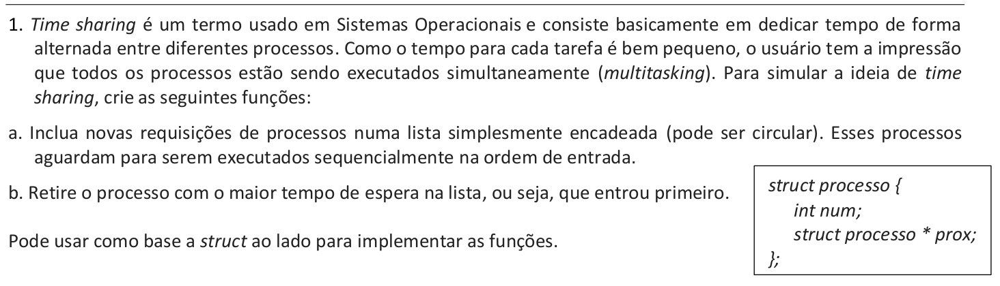

# Questão 1


<br>

### Declarações

```cpp
#include <iostream>
#include <stdlib.h>
using namespace std;

int menuOpcoes();
int geraNumeroParaProcesso();
bool VerificaListaVazia();
void imprimirProcessos();
void incluiProcesso();
void encerraProcesso();

struct process
{
    int num;

    struct process *prox;
};
typedef struct process *pro;

pro topo=NULL, ultimo=NULL;

```

### Main

```cpp
int main()
{
    int op;

    do
    {
        op = menuOpcoes(); 

        switch (op)
        {
        case 0:
            cout << "\n Desligando, até a proxima\n";
            break;
        case 1:
            incluiProcesso();
            break;
        case 2:
            encerraProcesso();
            break;
        case 3:
            imprimirProcessos();
            break;
        default:
            cout << "\n ERRO 973: Digite novamente \n";
            break;
        }
        cout << "\n__________________________________________";

    } while (op != 0);
}
```

### Incluir processo

```cpp
void incluiProcesso()
{

    pro pont = new process;
    int num = geraNumeroParaProcesso();

    pont->num = num;

    if (VerificaListaVazia())
    {
        topo = pont;
        ultimo = pont;
        pont->prox = topo;

    }
    else
    {
        
        pont->prox = topo;
        ultimo->prox = pont;
        ultimo=pont;

    }
}
```


### Encerrar processo

```cpp
void encerraProcesso()
{  
    if (VerificaListaVazia())
    {
        cout << "Lista de processos vazia";
    } 
    else {
      pro aux = topo;
      topo = topo->prox;
      
        if(topo == topo->prox){

            ultimo = NULL;
            topo = NULL;

            cout << "\n O ultimo processo: " << aux->num << " foi encerrado\n";
            cout << "\nAgora a lista de Processos Vazia\n";

            delete (aux);
        }
        else{

            ultimo->prox = topo;
            cout << "\n O processo: " << aux->num << " foi encerrado\n";

            delete (aux);
        }
      }
    
}
```


### Imprimir processo 
```cpp
void imprimirProcessos()
{
    if (VerificaListaVazia())
        cout << "\n Lista de processos vazia\n";

    else
    {
        pro aux = topo;

        do{
            cout << aux->num << "\t";
            aux = aux->prox;

        } while ((aux != topo));
        
    }
 
    cout << endl;
}
```